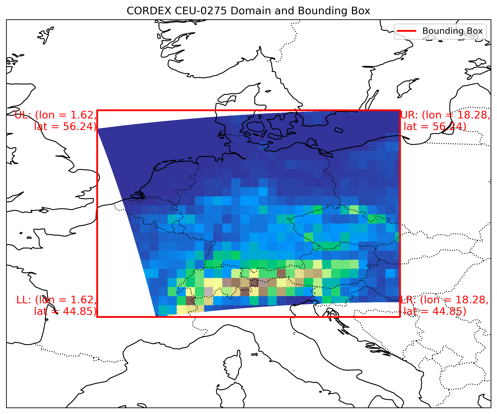

# CORDEX Domain Plotter


This script plots a CORDEX domain and its bounding box on a map. It saves the map as a  PNG file and prints the coordinates of the bounding box corners.

## Usage

1. Install dependencies:
   ```bash
   pip install numpy matplotlib cartopy py-cordex pyproj
   ```
2. Run the script:
    ```bash 
    python plot_domain.py <DOMAIN>
    ```
3. 
```bash 
python plot_domain.py EUR-11

```
## Example Output

```bash 
['LL: (lon = 1.62,\n lat = 44.85)', 'UL: (lon = 1.62,\n lat = 56.24)', 'UR: (lon = 18.28,\n lat = 56.24)', 'LR: (lon = 18.28,\n lat = 44.85)']
```



